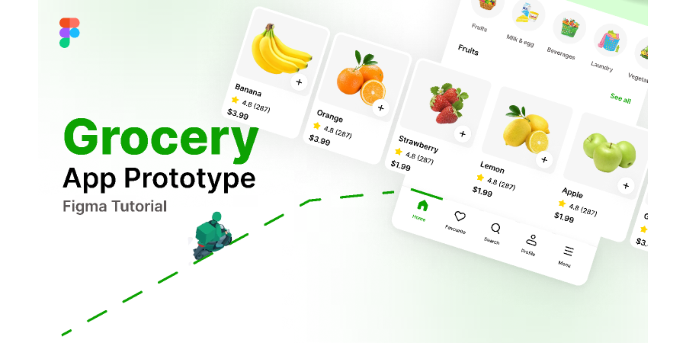
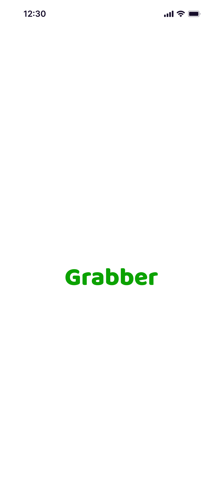
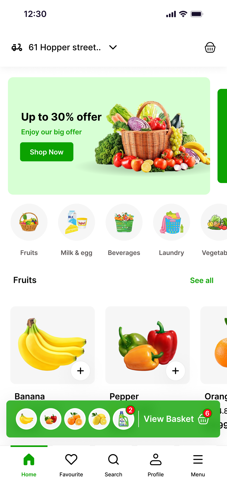
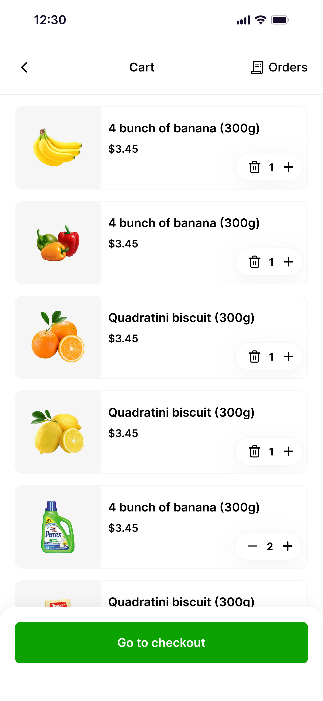
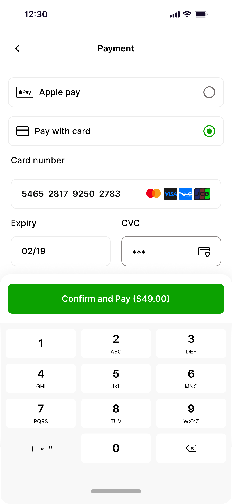
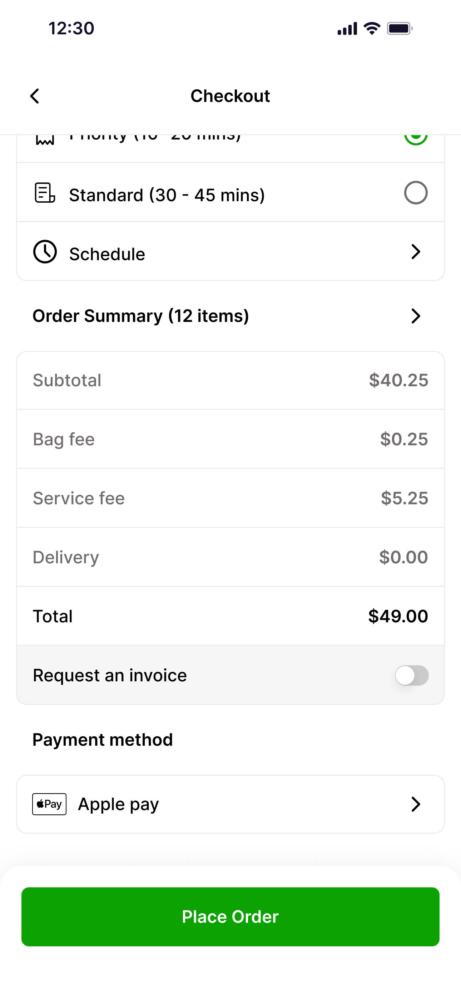
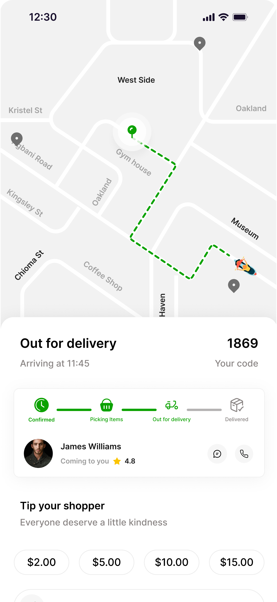

## ✨ Badges


---

## 🛒 Grabber Grocery

Grabber Grocery is a modern Flutter application designed for a smooth and intuitive online grocery shopping experience.
Built with clean architecture, state management (Cubit/BLoC), and Material 3 design, it offers a fast, reliable, and user-friendly way to browse.

---

## ✨ Features


---

### 🚀 Getting Started

To run this app locally:

```bash
git clone https://github.com/AmrSalahDev/Grabber.git
cd Grabber
flutter pub get
flutter run
```

---

## 📦 Dependencies Used

Below is a list of the main packages used in this Flutter project:


### 🎨 Figma Design

Here’s the app UI design created in Figma:

[](https://www.figma.com/community/file/1436702392024339380/grabber-grocrey-app)

📌 Click the image to view the live Figma prototype.


---

### 📸 Screenshots

<p float="left">
  
  
  
  
  
  
</p>


---

### 🛠️ Contributions

Feel free to fork the repo, open issues, or submit PRs to improve the app!
